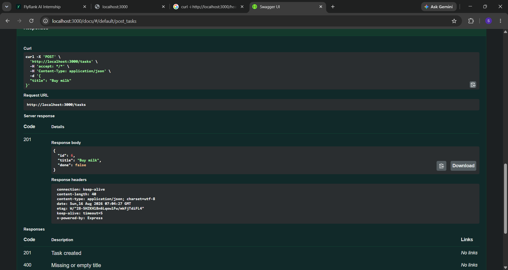

# Task API

A small in-memory CRUD API for managing a to-do list, built with **Node.js + Express** and documented with **Swagger UI**.

Data is stored only in memory (a plain JavaScript array) — it resets every time the server restarts. There is no database yet; that's next week.

## How to install & run

```bash
npm install
npm start
```

The server starts on **http://localhost:3000**.
Interactive docs (Swagger UI) are at **http://localhost:3000/docs**.

## Endpoints

| Method | Path         | Description                                                           | Success | Errors   |
| ------ | ------------ | --------------------------------------------------------------------- | ------- | -------- |
| GET    | `/`          | API info                                                              | 200     | —        |
| GET    | `/health`    | Health check                                                          | 200     | —        |
| GET    | `/tasks`     | List all tasks (supports `?done=`, `?search=`, `?limit=`, `?offset=`) | 200     | —        |
| GET    | `/tasks/:id` | Get a single task                                                     | 200     | 404      |
| POST   | `/tasks`     | Create a task (`{ "title": "..." }`)                                  | 201     | 400      |
| PUT    | `/tasks/:id` | Update a task's title and/or done                                     | 200     | 400, 404 |
| DELETE | `/tasks/:id` | Delete a task                                                         | 204     | 404      |
| GET    | `/stats`     | _(extra)_ task counts                                                 | 200     | —        |
| POST   | `/reset`     | _(extra)_ restore the 3 example tasks                                 | 200     | —        |

## Example: full CRUD via curl

Create a task:

```bash
curl -i -X POST http://localhost:3000/tasks \
  -H "Content-Type: application/json" \
  -d '{"title":"Buy milk"}'
```

```
HTTP/1.1 201 Created
Content-Type: application/json; charset=utf-8

{"id":4,"title":"Buy milk","done":false}
```

Read it back:

```bash
curl -i http://localhost:3000/tasks/4
```

Update it:

```bash
curl -i -X PUT http://localhost:3000/tasks/4 \
  -H "Content-Type: application/json" \
  -d '{"done":true}'
```

Delete it:

```bash
curl -i -X DELETE http://localhost:3000/tasks/4
```

Unknown id:

```bash
curl -i http://localhost:3000/tasks/99
# HTTP/1.1 404 Not Found
# {"error":"Task 99 not found"}
```

Invalid create:

```bash
curl -i -X POST http://localhost:3000/tasks -H "Content-Type: application/json" -d '{}'
# HTTP/1.1 400 Bad Request
# {"error":"title is required and must be a non-empty string"}
```

## Swagger UI



<!-- Replace the image above with your own screenshot of http://localhost:3000/docs
     showing "Try it out" after you run a full CRUD cycle in the browser. -->

## The mortality experiment

Restarting the server resets `tasks` back to the 3 seeded example tasks — anything created, updated, or deleted during the previous run is gone. This happens because the data lives only in a JavaScript array in the process's memory; nothing is ever written to disk. It's the reason Week 3 introduces a real database: to make data survive a restart.

## AI vs me

<!-- Fill this in if you do Stage 7 (bonus): your prompt, what the AI got right/wrong,
     what your prompt left unspecified, and what changed after one rematch. -->
