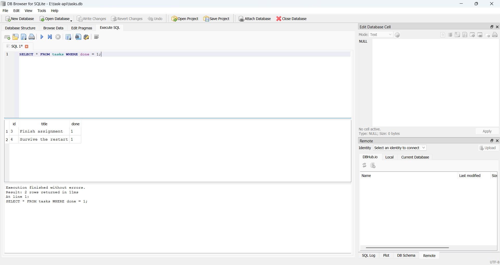

# Task API

A CRUD API for managing a to-do list, built with **Node.js + Express**, backed by a real **SQLite** database, and documented with **Swagger UI**.

This started as an in-memory API in Week 2 (see git history / Stage 0-1 commits for that version) and was upgraded in Week 3 to persist data in SQLite. The endpoints, request/response shapes, and status codes are identical between both versions — only the storage layer changed.

## Why SQLite

SQLite was chosen because it needs no separate database server: it's a single file (`tasks.db`) that gets created automatically the first time the app runs. That makes it perfect for a small project like this — zero setup, zero config, and the whole database can be inspected, copied, or deleted like any other file. For a production app with many concurrent writers you'd likely move to Postgres or MySQL later, but the API code wouldn't need to change — that's the whole lesson of this assignment.

## Where the database lives

The database file is `tasks.db`, created automatically in the project's root folder the first time you run `npm start`. It is **git-ignored** (see `.gitignore`) so every fresh clone starts with a clean, freshly-seeded database rather than inheriting someone else's data.

## How to install & run

```bash
npm install
npm start
```

The server starts on **http://localhost:3000** and automatically creates `tasks.db` with the `tasks` table and 3 seeded example tasks (only on the very first run — restarting never duplicates them).

Interactive docs (Swagger UI) are at **http://localhost:3000/docs**.

## Endpoints

| Method | Path         | Description                                                           | Success | Errors   |
| ------ | ------------ | --------------------------------------------------------------------- | ------- | -------- |
| GET    | `/`          | API info                                                              | 200     | —        |
| GET    | `/health`    | Health check                                                          | 200     | —        |
| GET    | `/tasks`     | List all tasks (supports `?done=`, `?search=`, `?limit=`, `?offset=`) | 200     | —        |
| GET    | `/tasks/:id` | Get a single task                                                     | 200     | 404      |
| POST   | `/tasks`     | Create a task (`{ "title": "..." }`)                                  | 201     | 400      |
| PUT    | `/tasks/:id` | Update a task's title and/or done                                     | 200     | 400, 404 |
| DELETE | `/tasks/:id` | Delete a task                                                         | 204     | 404      |
| GET    | `/stats`     | _(extra)_ task counts, computed with SQL `COUNT()`                    | 200     | —        |
| POST   | `/reset`     | _(extra)_ restore the 3 example tasks                                 | 200     | —        |

All CRUD operations use **parameterized SQL queries** (`?` placeholders) — no user input is ever glued directly into a SQL string.

## Example: full CRUD via curl

Create a task:

```bash
curl -i -X POST http://localhost:3000/tasks \
  -H "Content-Type: application/json" \
  -d '{"title":"Buy milk"}'
```

```
HTTP/1.1 201 Created
Content-Type: application/json; charset=utf-8

{"id":4,"title":"Buy milk","done":false}
```

Now **stop the server and start it again** — then run:

```bash
curl -i http://localhost:3000/tasks
```

Task 4 is still there. That's the entire point of this week's assignment: in the Week 2 version, restarting wiped it out; now it survives.

Unknown id:

```bash
curl -i http://localhost:3000/tasks/999
# HTTP/1.1 404 Not Found
# {"error":"Task 999 not found"}
```

Invalid create:

```bash
curl -i -X POST http://localhost:3000/tasks -H "Content-Type: application/json" -d '{}'
# HTTP/1.1 400 Bad Request
# {"error":"title is required and must be a non-empty string"}
```

## Swagger UI


## Exploring the database directly (Stage 4)

Open `tasks.db` in [DB Browser for SQLite](https://sqlitebrowser.org/) and run queries by hand in its "Execute SQL" tab. The API and DB Browser read the exact same file — there's no syncing, so any change you make shows up immediately through the API and vice versa, with no restart needed.



Example query I ran:

```sql
SELECT * FROM tasks WHERE done = 1;
```

This returned every task marked complete — in my case, just `"Finish assignment"` — confirming the `done` column is stored as SQLite's `0`/`1` and that a plain `WHERE` clause filters it correctly, exactly like the API's own `?done=true` filter does internally.

## The mortality experiment (Week 2 vs Week 3)

In Week 2, restarting the server wiped every task back to the 3 seeded examples, because the data lived only in a JavaScript array in memory. This week, I created a task, fully killed the server process, and started it again — the task was still there, and no reseed occurred. The only thing that changed between the two weeks is where the data lives (RAM vs. a file on disk); the API code that clients talk to is otherwise identical.

## Why pagination matters

`GET /tasks` supports `?limit=` and `?offset=` (e.g. `/tasks?limit=2&offset=2`), implemented with SQL's `LIMIT`/`OFFSET`. Real APIs almost never return their entire dataset in one response — if a table has a million rows, sending all of them would be slow, waste bandwidth, and could crash the client trying to hold that much data in memory. Pagination lets the client ask for a manageable page at a time and load more as needed.

## AI vs me

<!-- Fill this in if you do the bonus AI rematch stage: your prompt, what the AI got right/wrong,
     what your prompt left unspecified, and what changed after one rematch. -->
