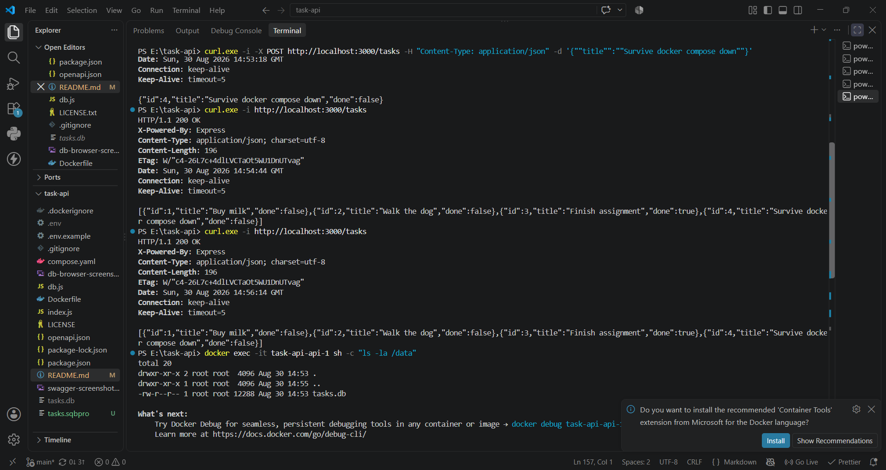

# Task API

A CRUD API for managing a to-do list, built with **Node.js + Express**, backed by a real **SQLite** database, documented with **Swagger UI**, and containerized with **Docker**.

This started as an in-memory API in Week 2 (see git history / Stage 0-1 commits for that version), was upgraded in Week 3 to persist data in SQLite, and is now containerized so the whole stack starts with a single command. The endpoints, request/response shapes, and status codes are identical across all three versions — only the storage and deployment layers changed.

## Why SQLite

SQLite was chosen because it needs no separate database server: it's a single file (`tasks.db`) that gets created automatically the first time the app runs. That makes it perfect for a small project like this — zero setup, zero config, and the whole database can be inspected, copied, or deleted like any other file. For a production app with many concurrent writers you'd likely move to Postgres or MySQL later, but the API code wouldn't need to change — that's the whole lesson of this assignment.

## Where the database lives

The database file is `tasks.db`. Locally (no Docker), it's created automatically in the project's root folder the first time you run `npm start`. Inside Docker, `DB_PATH` is set to `/data/tasks.db`, which is mounted from a named volume (`taskdata`) — see "Persistence" below. Either way it is **git-ignored** (see `.gitignore`) so every fresh clone or fresh container starts with a clean, freshly-seeded database rather than inheriting someone else's data.

## How to run

**Option A — with Docker (recommended, one command):**

```bash
cp .env.example .env
docker compose up
```

That builds the app image, starts a container, and mounts a named volume (`taskdata`) at `/data` so `tasks.db` survives container restarts and rebuilds. The server is reachable at **http://localhost:3000**.

To stop everything: `docker compose down` (add `-v` only if you actually want to wipe the volume and lose your data).

**Option B — without Docker, straight on your machine:**

```bash
npm install
npm start
```

Both options run the exact same code and produce identical behaviour — the API doesn't know or care whether it's containerized.

The server automatically creates `tasks.db` with the `tasks` table and 3 seeded example tasks (only on the very first run — restarting never duplicates them).

Interactive docs (Swagger UI) are at **http://localhost:3000/docs**.

> **Node version note:** `better-sqlite3` requires Node 22+. The `Dockerfile` uses `node:22-slim` for this reason — an earlier version built on `node:20-slim` compiled successfully but crashed on startup (exit code 139) the moment it tried to load the native SQLite binding, since the binding was built against the wrong Node ABI.

## Config and secrets

Config lives in the environment, not in code. `.env` is git-ignored; `.env.example` is the committed template showing which variables exist (`PORT`). `DB_PATH` — where the SQLite file lives — is set directly in `compose.yaml` rather than `.env`, since it's tied to the volume mount (container wiring) rather than being a secret.

## Persistence across a container restart (the actual point of this assignment)

I created a task while running via `docker compose up`, then ran `docker compose down` (which fully removes the container — not just stops it) followed by `docker compose up -d`. The task was still there — and I repeated the full teardown/rebuild cycle a second time to be sure, with the same result both times.

I also opened a shell inside the running container to see the volume directly:

```bash
docker exec -it task-api-api-1 sh -c "ls -la /data"
```

```
total 20
drwxr-xr-x 2 root root  4096 Aug 30 14:53 .
drwxr-xr-x 1 root root  4096 Aug 30 14:55 ..
-rw-r--r-- 1 root root 12288 Aug 30 14:53 tasks.db
```

This confirms `tasks.db` lives at `/data/tasks.db`, the path mounted from the `taskdata` named volume — not baked into the container's own filesystem.

This is what makes it survive: `taskdata` is a **named volume**, kept by Docker independently of any specific container. `docker compose down` destroys the container and its filesystem, but the volume — and the database file inside it — persists on disk regardless. If I'd skipped the volume entirely, `tasks.db` would have been part of the container's own filesystem, and `docker compose down` would have deleted it right along with the container — back to zero tasks, or a fresh seed. That's the exact "mortality experiment" from Week 2, just one layer further down the stack.



## Endpoints

| Method | Path         | Description                                                           | Success                     | Errors   |
| ------ | ------------ | --------------------------------------------------------------------- | --------------------------- | -------- |
| GET    | `/`          | API info                                                              | 200                         | —        |
| GET    | `/health`    | Health check — also pings the database                                | 200 (503 if db unreachable) | —        |
| GET    | `/tasks`     | List all tasks (supports `?done=`, `?search=`, `?limit=`, `?offset=`) | 200                         | —        |
| GET    | `/tasks/:id` | Get a single task                                                     | 200                         | 404      |
| POST   | `/tasks`     | Create a task (`{ "title": "..." }`)                                  | 201                         | 400      |
| PUT    | `/tasks/:id` | Update a task's title and/or done                                     | 200                         | 400, 404 |
| DELETE | `/tasks/:id` | Delete a task                                                         | 204                         | 404      |
| GET    | `/stats`     | _(extra)_ task counts, computed with SQL `COUNT()`                    | 200                         | —        |
| POST   | `/reset`     | _(extra)_ restore the 3 example tasks                                 | 200                         | —        |

All CRUD operations use **parameterized SQL queries** (`?` placeholders) — no user input is ever glued directly into a SQL string.

## Example: full CRUD via curl

Create a task:

```bash
curl -i -X POST http://localhost:3000/tasks \
  -H "Content-Type: application/json" \
  -d '{"title":"Buy milk"}'
```

```
HTTP/1.1 201 Created
Content-Type: application/json; charset=utf-8

{"id":4,"title":"Buy milk","done":false}
```

Now **restart the whole stack** (`docker compose down && docker compose up -d`, or just stop/start if running locally) — then run:

```bash
curl -i http://localhost:3000/tasks
```

Task 4 is still there. That's the entire point of this and last week's assignments: in the Week 2 in-memory version, restarting wiped it out; now it survives even a full container teardown.

Unknown id:

```bash
curl -i http://localhost:3000/tasks/999
# HTTP/1.1 404 Not Found
# {"error":"Task 999 not found"}
```

Invalid create:

```bash
curl -i -X POST http://localhost:3000/tasks -H "Content-Type: application/json" -d '{}'
# HTTP/1.1 400 Bad Request
# {"error":"title is required and must be a non-empty string"}
```

## Swagger UI


## Exploring the database directly (Stage 4)

Open `tasks.db` in [DB Browser for SQLite](https://sqlitebrowser.org/) and run queries by hand in its "Execute SQL" tab. The API and DB Browser read the exact same file — there's no syncing, so any change you make shows up immediately through the API and vice versa, with no restart needed.


Example query I ran:

```sql
SELECT * FROM tasks WHERE done = 1;
```

This returned every task marked complete — confirming the `done` column is stored as SQLite's `0`/`1` and that a plain `WHERE` clause filters it correctly, exactly like the API's own `?done=true` filter does internally.

## The mortality experiment (Week 2 vs Week 3 vs Docker)

In Week 2, restarting the server wiped every task back to the 3 seeded examples, because the data lived only in a JavaScript array in memory. In Week 3, I created a task, fully killed the server process, and started it again — the task was still there, because it now lived in a SQLite file on disk instead of in memory. This week (Docker), I went a layer further: even fully destroying and recreating the _container itself_ (`docker compose down` / `up`) didn't lose the data, because the SQLite file lives in a Docker volume that outlives any individual container. Each week moved storage one layer further from "gone the moment the process stops" toward "actually durable" — and the API on top never had to change to get there.

## Why pagination matters

`GET /tasks` supports `?limit=` and `?offset=` (e.g. `/tasks?limit=2&offset=2`), implemented with SQL's `LIMIT`/`OFFSET`. Real APIs almost never return their entire dataset in one response — if a table has a million rows, sending all of them would be slow, waste bandwidth, and could crash the client trying to hold that much data in memory. Pagination lets the client ask for a manageable page at a time and load more as needed.

## AI vs me

<!-- Fill this in if you do the bonus AI rematch stage: your prompt, what the AI got right/wrong,
     what your prompt left unspecified, and what changed after one rematch. -->
